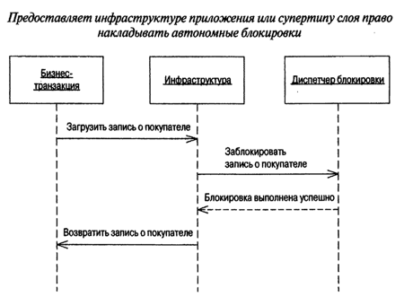

[prev](page10.md)
# Паттерны offline конкурентного доступа

### Неявная блокировка (Implicit Lock)

###### Автор много говорит о важности блокировки. Думаю не стоит повторять его доводы, все согласны. О сложности автоматического тестирования блокировок тоже говорить излишне. Поэтому выполнением наиболее важных процедур блокирования должны заниматься не разработчики, а само приложение. Супертипы слоя, инфраструктура и генерация кода  предоставляют широкие возможности по реализации неявной блокировки.

Для обеспечения:
1. Составить список процедур необходимых в рамках стратегии блокирования
2. Гарантировать автоматическое выполнение процедур
###### Эту проверку можно поручить инфраструктуре приложения.
3. Отсутствие блокировки на момент фиксации изменения является ошибкой и должно привести к отказу подтверждения
изменения. А еще лучше — генерации исключения.
4. Позаботиться о предотвращении взаимоблокировок.

### Назначение

Следует применять во всех приложениях кроме не имеющих инфраструктуры.

[next](page12.md)