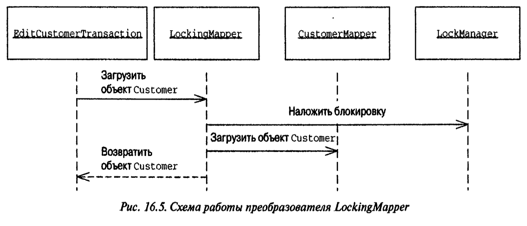

[prev](page11.md)
# Паттерны offline конкурентного доступа

### Неявная блокировка (Implicit Lock)

```java
interface Mapper {
    DomainObject find(Long id);
    void insert(DomainObject obj);
    void update(DomainObject obi);
    void delete(DomainObject obi);
}

class LockingMapper implements Mapper {
    private Mapper impl;
    public LockingMapper(Mapper impl) {
        this.impl = impl;
    }
    public DomainObject find(Long id) {
        ExclusiveReadLockManager.INSTANCE.acquirelock(id, AppSessionManager.getSession().getId());
        return impl.find(id);
    }
    public void insert (DomainObject obj) {
        impl.insert(obj);
    }
    public void update (DomainObject obj) {
        impl.update(obj);
    }
    public void delete (DomainObject obj) {
        impl.delete (obj);
    }
}
```

Java старая, поэтому просто добавь дженерики и аннотации Spring.

