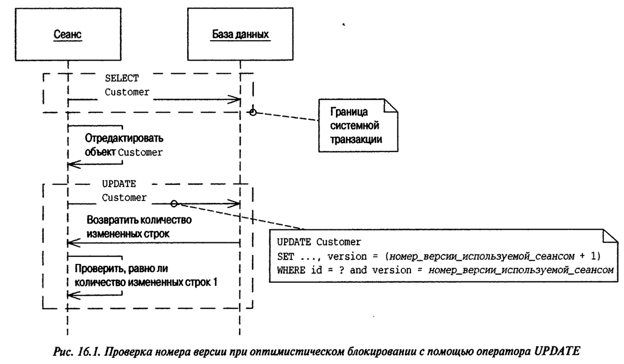

[prev](page2.md)
# Паттерны offline конкурентного доступа

### Оптимистическая offline блокировка удостоверяется, не вступят ли изменения, которые должны быть зафиксированы одним сеансом, в конфликт с изменениями, выполненными другим сеансом.

1. Отличие от online в том что тут речь о бизнес-транзакции, а не технической.
###### Когда запись из БД берется и передается на UI, текущая транзакция заканчивается и на UI данные правятся вне транзакции. Потом они отредактированные передаются снова на бэк и бэк достает из БД данные которые уже могли отличаться от тех что передавались на UI и эти данные обновляются. Здесь потенциально возможна потеря обновленных данных путем затирания их более свежей версией обхекта который может содержать устаревгие и мзиененные в другой транзакции данные.
2. Отличие от пессимистичной в том, что вероятность возникновения конфликта считается незначительной.
3. Принцип действия такой же как у online - инкрементом монотонно возрастающий тип данных.

###### Однако не стоит пользоваться временной меткой, так как она возможно будет выставляться на разных машинах, а системные часы слишком не надежны.
5. Можно вместо Version использовать для <code>UPDATE WHERE</code> сравнение по всем полям. Но это может негативно сказаться на производительности

[next](page4.md)