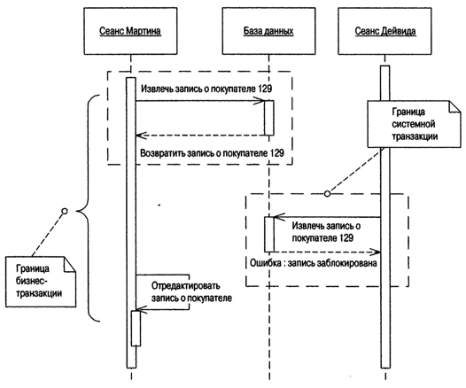

[prev](page4.md)
# Паттерны offline конкурентного доступа

### Пессимистическая offline блокировка

###### Предотвращает возникновение конфликта между параллельными бизнес-транзакциями, предоставляя доступ к данным в конкретный момент времени только одной бизнес-транзакции.

[next](page6.md)