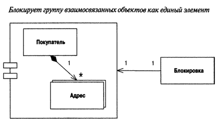
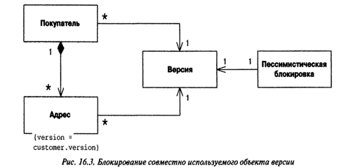

[prev](page7.md)
# Паттерны offline конкурентного доступа

### Блокировка с низкой степенью детализации (Coarse-Grained Lock)

1. Загрузка большого числа объектов блокировки для оптимистичной offline блокировки нагружает сеть.
2. Большие группы объектов блокировки для пессимистичной offline блокировки запутывает управление блокировким и может привести к дедлоку.

### Принцип действия

Для реализации необходимо создать единую точку конкуренции за право доступа к группе блокируемых элементов и предоставить короткий путь для доступа к элементу блокировки.
 Для реализации пессимистичной блокировки, ее можно накладывать на версию. Все равно рна будет меняться у всей группы разом.

[next](page9.md)