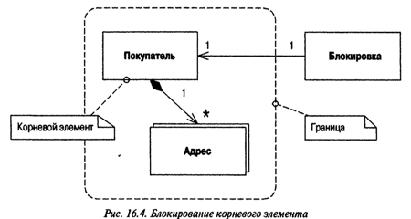

[prev](page8.md)
# Паттерны offline конкурентного доступа

### Блокировка с низкой степенью детализации (Coarse-Grained Lock)

Агрегат — совокупность взаимосвязанных объектов, рассматриваемых с точки внесения изменений как единое целое. У каждого агрегата есть _root_ и граница.

Блокирование агрегата представляет собой еще обну форму блокировки с низкой степенью детализации.

[next](page10.md)